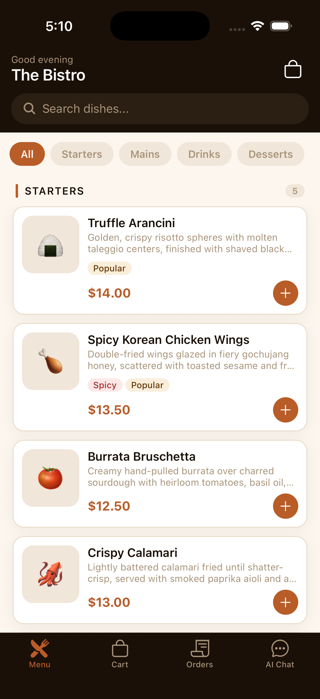
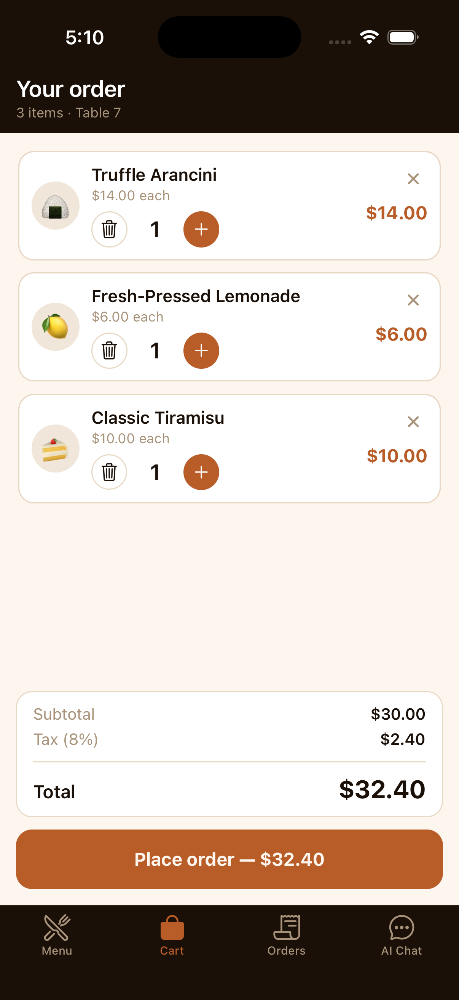
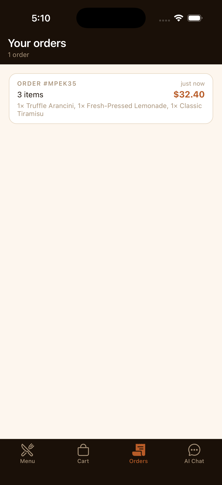
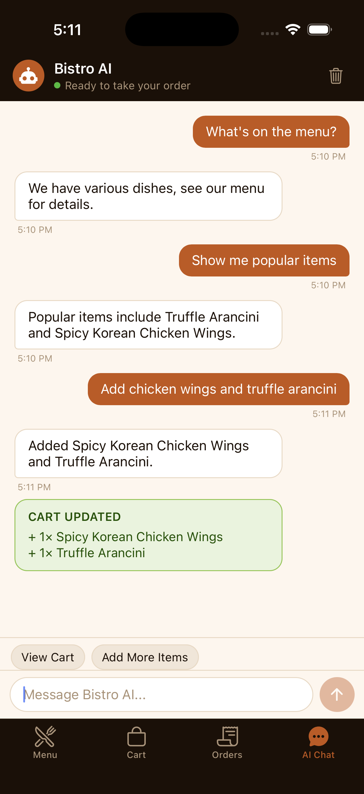
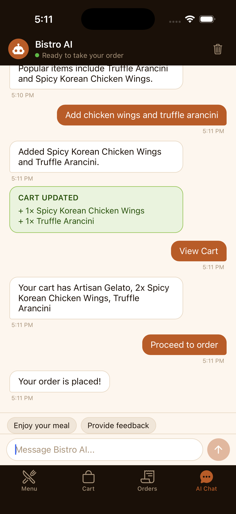

# The Intelligent Bistro

A premium restaurant ordering app with a conversational AI agent that takes orders by chat.

The repo has two workspaces:

- **`bistro-backend`** — Node.js + Express API, Groq-backed AI agent, in-memory session/cart store.
- **`bistro-app`** — Expo SDK 54 (React Native 0.81) client with expo-router, NativeWind, Reanimated, and a 4-tab UI.

## Screens

| Menu | Cart | Orders |
|:---:|:---:|:---:|
|  |  |  |

### AI Chat

| Add via chat | Place order via chat |
|:---:|:---:|
|  |  |

## Tech stack

| Layer | Tooling |
| --- | --- |
| Mobile runtime | Expo SDK 54, React Native 0.81 |
| Routing | expo-router 6 (file-based, 4 tabs) |
| Styling | NativeWind v4 (Tailwind utility classes) |
| Animations | react-native-reanimated 4 |
| Gestures | react-native-gesture-handler 2 |
| Bottom sheets | @gorhom/bottom-sheet 5 |
| State | Zustand 5 (cart, menu, chat, orders) |
| Haptics | expo-haptics |
| Backend | Node 20, Express 4, express-rate-limit, morgan |
| AI | Groq SDK (`llama-3.3-70b-versatile`) with strict JSON-mode responses |

## Features

### AI ordering
The chat tab is a conversational interface backed by Groq. Each turn, the model receives the live menu and the current cart, and replies in a strict JSON schema: `{ reply, actions, suggestions }`. Action types (`add_item`, `remove_item`, `update_qty`, `clear_cart`, `place_order`) are validated against the menu — the AI can't invent items or prices. Suggestions become tappable chips above the input bar.

### Cart & orders, separated
The Cart tab shows only what you're about to order. The Orders tab keeps your history of placed orders (id, time, item count, total, line items). The bag icon on the Menu header jumps you to the cart. Both tabs stay accessible regardless of state, so you can review history while a new cart is in progress.

### AI place-order flow
Ask the assistant "place my order" with items in your cart and it returns a `place_order` action. The app records the order in the orders store, clears the cart, syncs the backend session, and shows a success toast. The backend also resets the session history so the next conversation starts fresh.

### Polished details
- Skeleton shimmer while menu loads
- Cart badge with color flash on increment
- Toast notifications slide down from the top
- Swipe-left to delete cart rows with smooth height collapse
- Bottom-sheet item detail with quantity stepper
- Error boundary catches render errors with a friendly retry screen
- Network failures surface as a toast and a "Retry" suggestion chip

## Setup

### Prerequisites
- Node.js 20+
- A [Groq API key](https://console.groq.com/keys)
- Either: iOS Simulator (Xcode), Android emulator (Android Studio), or Expo Go on a physical phone

### Backend

```bash
cd bistro-backend
npm install
cp .env.example .env
# edit .env and paste your GROQ_API_KEY
npm run dev
```

The API starts on `http://localhost:3001`. Health check: `GET /health`.

### Mobile app

```bash
cd bistro-app
npm install
npx expo start --clear
```

Then press **`i`** (iOS simulator), **`a`** (Android emulator), or **`w`** (web).

If you're running on a physical device or Android emulator, `localhost` won't resolve to your laptop. Create `bistro-app/.env`:

```
EXPO_PUBLIC_API_URL=http://<your-lan-ip>:3001/api
```

Find your IP with `ifconfig | grep "inet " | grep -v 127.0.0.1` (macOS/Linux) or `ipconfig` (Windows). Restart `npx expo start --clear` after editing.

## Project structure

```
intelligent-bistro/
├── bistro-backend/
│   ├── index.js              # Express server, routes, rate limits, morgan logging
│   └── src/
│       ├── data/menu.json    # The 21-item menu
│       ├── routes/           # /menu, /chat, /cart, /session
│       ├── services/         # aiService (Groq + retry), sessionService
│       └── middleware/       # cors, error handler
├── bistro-app/
│   ├── app/
│   │   ├── _layout.tsx       # Providers (gesture, safe-area, error boundary, toast, bottom sheet)
│   │   └── (tabs)/           # menu, cart, orders, chat
│   ├── components/
│   │   ├── ui/               # Themed primitives, Tag, Stepper, Toast, Cart badge, …
│   │   ├── menu/             # MenuItemCard, CategoryHeader, ItemDetailSheet
│   │   ├── orders/           # OrderCard
│   │   └── chat/             # MessageBubble
│   ├── services/api.ts       # Typed fetch client
│   ├── store/                # cartStore, menuStore, chatStore, ordersStore (Zustand)
│   └── types/                # Shared TS types
└── docs/screenshots/
```

## Environment variables

### `bistro-backend/.env`
| Var | Purpose |
| --- | --- |
| `PORT` | Backend port (default 3001) |
| `GROQ_API_KEY` | Required for the chat endpoint |
| `NODE_ENV` | `development` enables morgan request logging |

### `bistro-app/.env` (optional)
| Var | Purpose |
| --- | --- |
| `EXPO_PUBLIC_API_URL` | Override the default `http://localhost:3001/api` |
